# Lab02 - Movie Reviews Backend API

## 1. Mục tiêu
- Xây dựng backend cho project **Movie Reviews** bằng **Node.js + Express**.
- Kết nối đến cơ sở dữ liệu **MongoDB Atlas** với driver `mongodb`.
- Tổ chức code theo mô hình tách lớp: **Route - Controller - DAO**.
- Triển khai API lấy danh sách phim và hỗ trợ lọc theo `rated` hoặc `title`.
- Làm quen với quản lý biến môi trường bằng file `.env`.

## 2. Thông tin sinh viên
- Họ tên: Hồ Thị Minh Ngọc
- MSSV: 23521022
- Lớp: IE213.Q21.1
- Môn học: IE213.Q21 - Kỹ thuật phát triển hệ thống Web

## 3. Công cụ và môi trường sử dụng
- Node.js: Runtime chạy backend.
- Express.js: Framework xây dựng REST API.
- MongoDB Atlas: Cơ sở dữ liệu cloud.
- MongoDB Node.js Driver: Kết nối và thao tác dữ liệu MongoDB.
- Dotenv: Quản lý biến môi trường.
- CORS: Cho phép gọi API từ frontend/client.
- Nodemon: Hỗ trợ chạy server trong quá trình phát triển.
- Postman/Browser: Kiểm thử API endpoint.
- Hệ điều hành: Windows 11.

## 4. Nội dung thực hiện

Để dễ theo dõi, backend được tổ chức theo cấu trúc sau:

```text
Lab02/
├── README.md
├── LAB02-IE213.docx
├── screenshots/
└── movie-reviews/
	└── backend/
		├── package.json      # Khai báo project, scripts, dependencies
		├── .env              # Biến môi trường (PORT, DB URI, namespace)
		├── index.js          # Điểm khởi chạy server và kết nối MongoDB
		├── server.js         # Cấu hình Express app, middleware, route
		├── api/
		│   ├── movies.route.js       # Định nghĩa endpoint
		│   └── movies.controller.js  # Xử lý request/response
		└── dao/
			└── moviesDAO.js          # Tầng truy cập dữ liệu MongoDB
```

### 4.1 Khởi tạo project backend
- Tạo cấu trúc thư mục `movie-reviews/backend`.
- Khởi tạo `package.json` và cài các dependencies cần thiết.

### 4.2 Cấu hình môi trường
- Tạo file `.env` gồm các biến:
	- `PORT=3000`
	- `MOVIEREVIEWS_DB_URI=<mongodb_atlas_uri>`
	- `MOVIEREVIEWS_NS=sample_mflix`

### 4.3 Tạo Express server
- Tạo `server.js` để cấu hình middleware `cors`, `express.json`.
- Khai báo route chính `/api/v1/movies`.
- Xử lý route không tồn tại với mã lỗi 404.

### 4.4 Kết nối MongoDB Atlas
- Tạo `index.js` để:
	- Đọc biến môi trường bằng `dotenv`.
	- Kết nối MongoDB bằng `MongoClient`.
	- Inject collection handle qua `MoviesDAO.injectDB(client)`.
	- Khởi chạy server theo `PORT`.

### 4.5 Xây dựng DAO
- Tạo `dao/moviesDAO.js` để:
	- Truy cập collection `movies` trong database `sample_mflix`.
	- Truy vấn danh sách phim có phân trang.
	- Hỗ trợ filter theo `title` (text search) và `rated`.

### 4.6 Xây dựng Controller và Route
- Tạo `api/movies.controller.js` để:
	- Nhận query params `page`, `moviesPerPage`, `rated`, `title`.
	- Gọi DAO lấy dữ liệu.
	- Trả JSON response theo chuẩn API.
- Tạo `api/movies.route.js` để map endpoint:
	- `GET /api/v1/movies`

## 5. Cách chạy
1. Mở terminal tại thư mục `Lab02/movie-reviews/backend`.
2. Cài dependencies:
	 - `npm install`
3. Chạy server:
	 - `npm run dev`
4. Truy cập API:
	 - `http://localhost:3000/api/v1/movies`

## 6. Kết quả
- Khởi tạo backend thành công theo cấu trúc chuẩn.
- Kết nối MongoDB Atlas thành công.
- API `GET /api/v1/movies` trả dữ liệu JSON.
- Lọc theo `rated` và `title` hoạt động. Ví dụ endpoint: GET http://localhost:3000/api/v1/movies?title=blacksmith

## 7. Báo cáo chi tiết

Báo cáo đầy đủ của bài thực hành được trình bày trong file:

**LAB02-IE213.docx** (Tải về để xem)

## 8. Một số hình ảnh minh họa
### Phiên bản Node.js
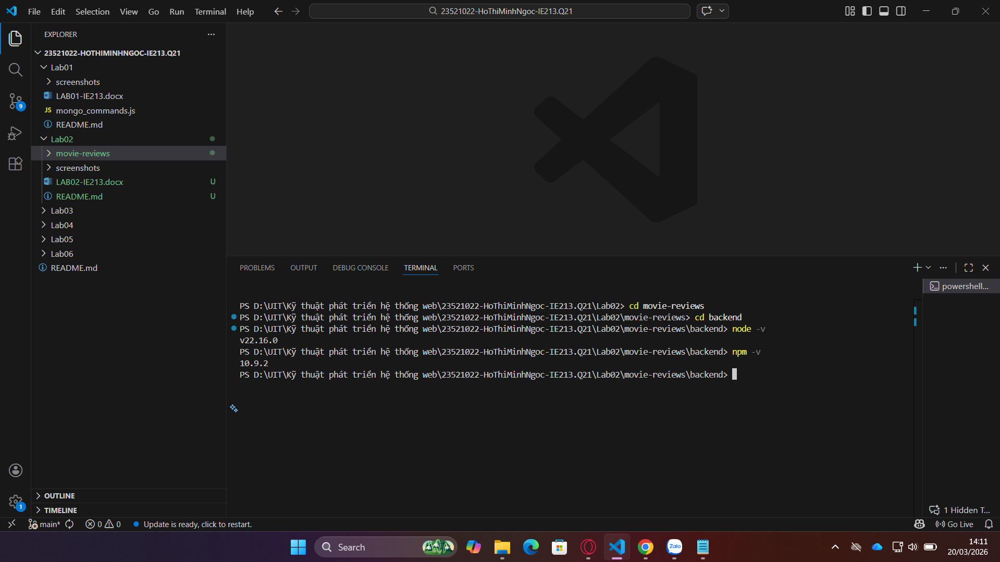

### Khởi tạo npm project
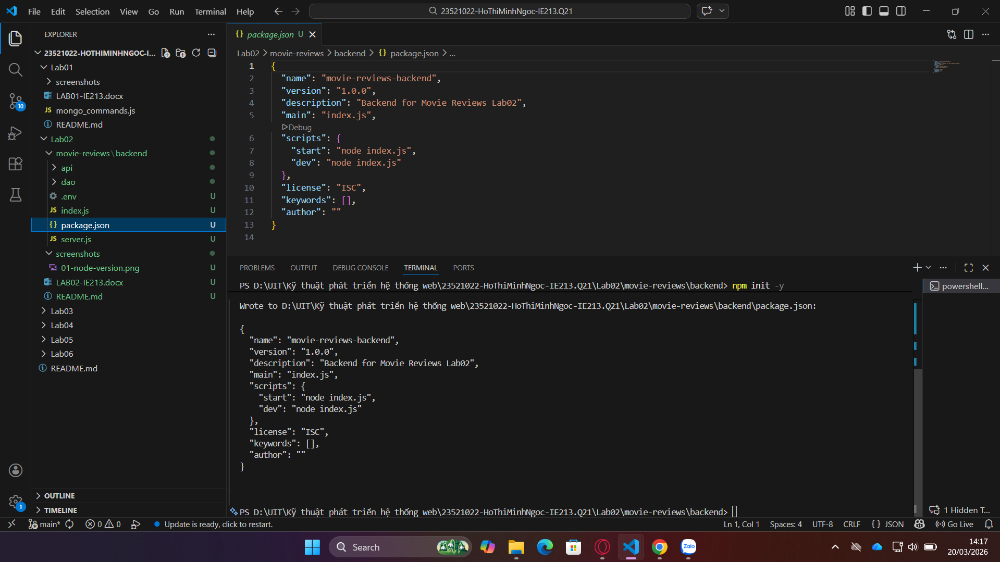

### Cài dependencies
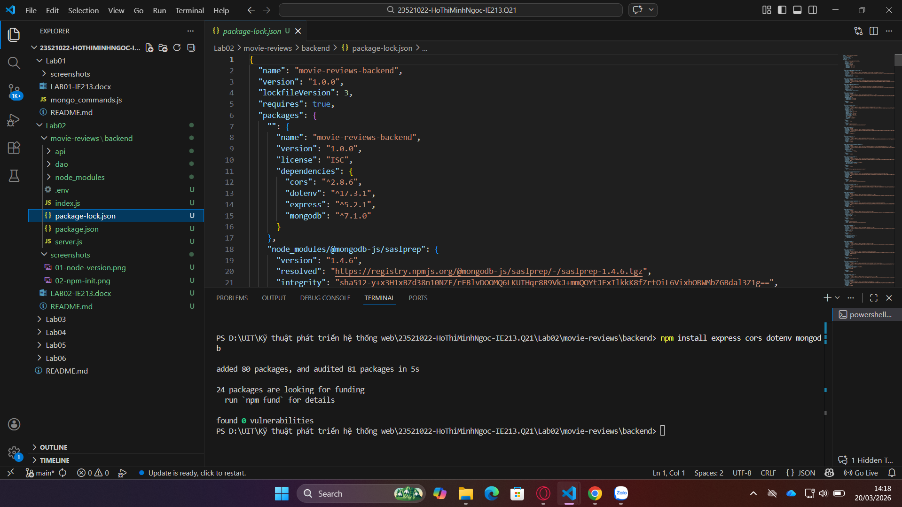

### Cài nodemon
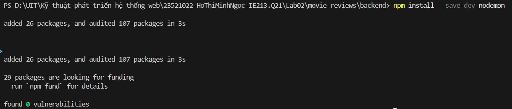

### Cấu hình package.json
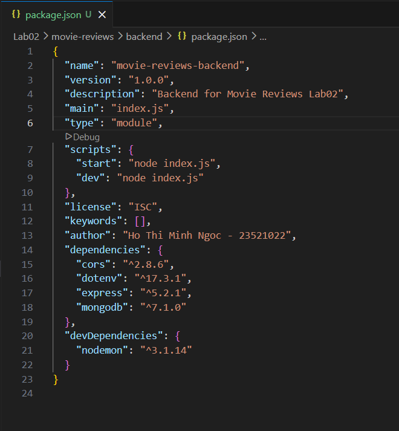

### Tạo file .env
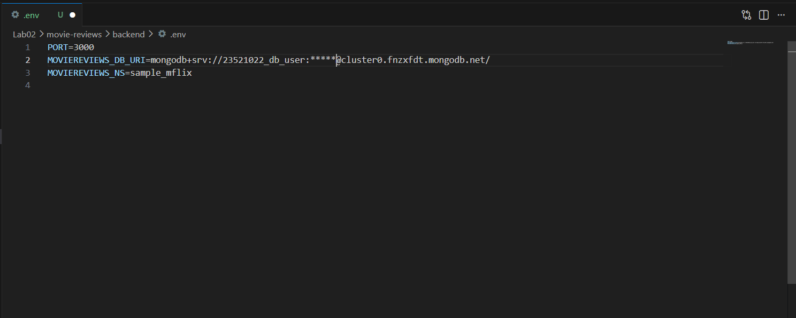

### Cấu hình server.js
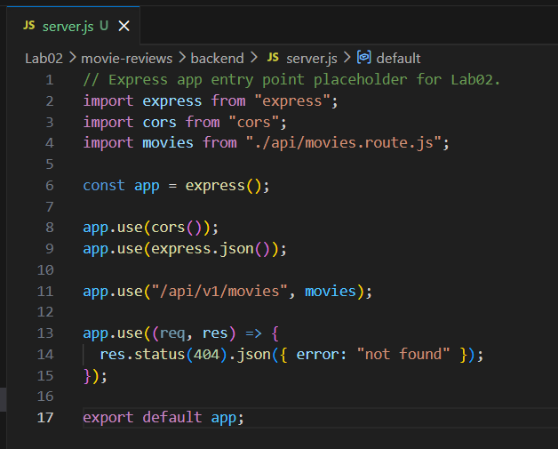

### Chạy server
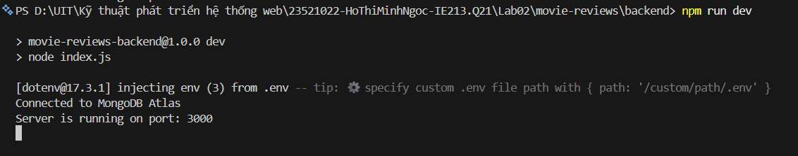

### API trả danh sách phim
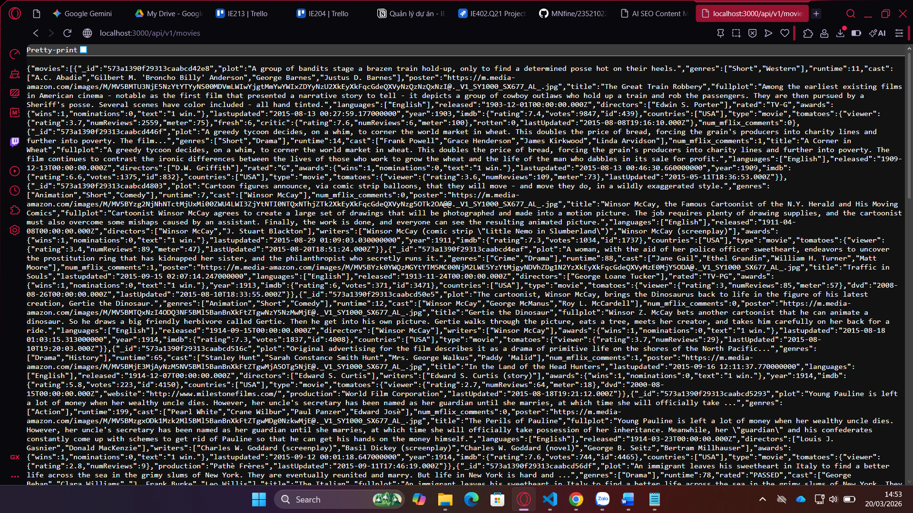

### Filter theo rated
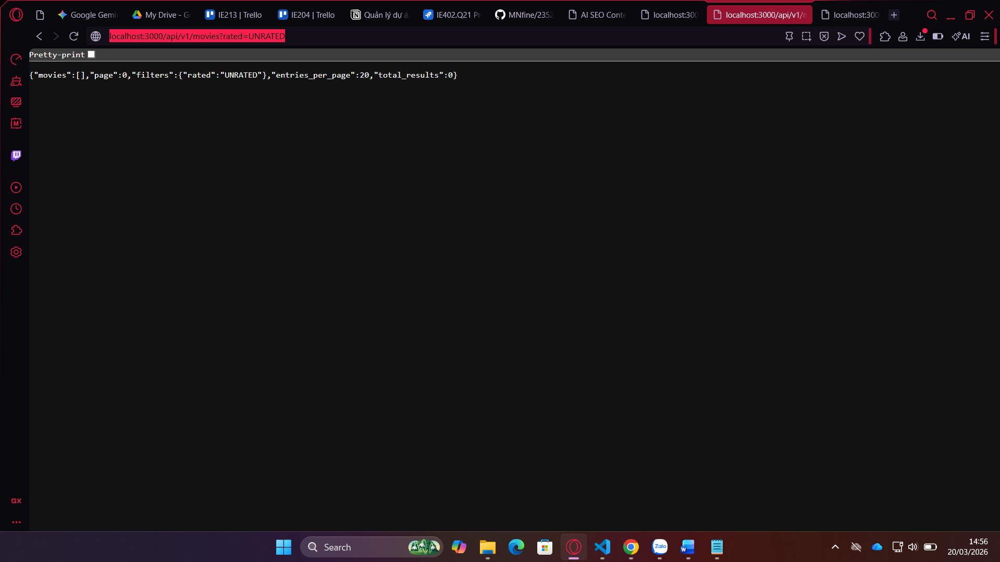

### Filter theo title
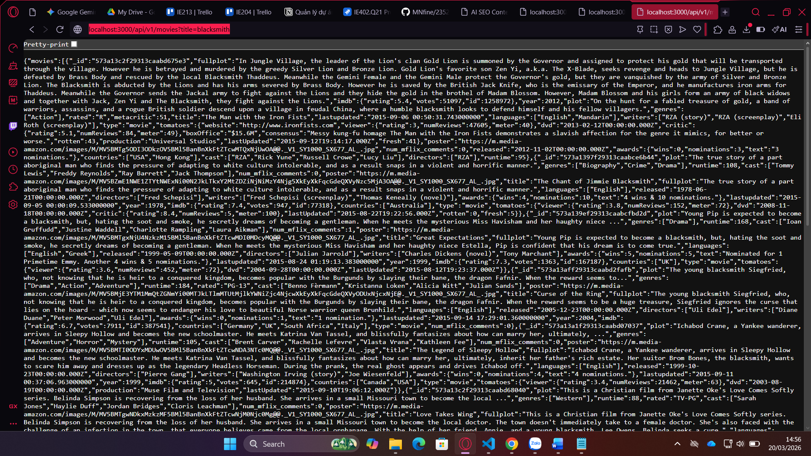

## 9. Đánh giá
### Đã hoàn thành
- Hoàn thành backend cơ bản cho Movie Reviews API.
- Tổ chức code theo Route - Controller - DAO.
- Truy vấn và lọc dữ liệu từ MongoDB Atlas thành công.
- Có ảnh minh họa các bước thực hiện và kết quả API.

### Chưa hoàn thành
- Không.

## 10. Ghi chú sử dụng AI
- Công cụ sử dụng: ChatGPT, Github Copilot.
- Mục đích sử dụng: hỗ trợ gợi ý cấu trúc project backend, chuẩn hóa README, rà soát cú pháp Node.js/Express.
- AI chỉ hỗ trợ phần trình bày tài liệu và tham khảo kỹ thuật, toàn bộ thao tác cài đặt, viết code và kiểm thử được thực hiện thủ công bởi sinh viên.
